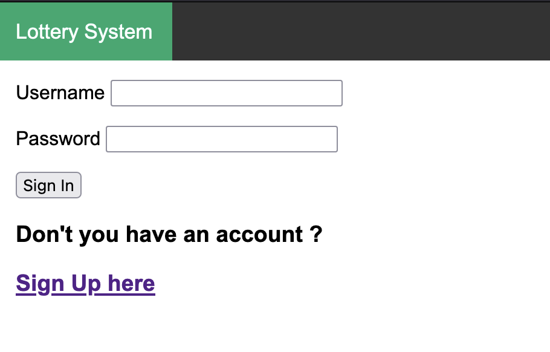
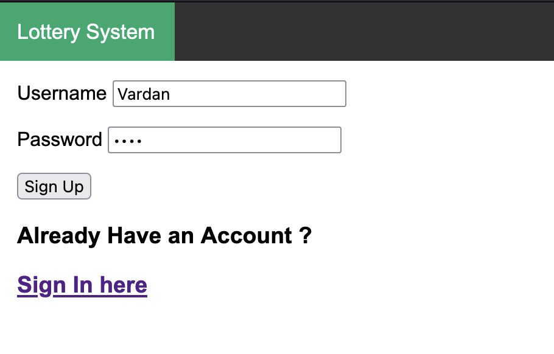
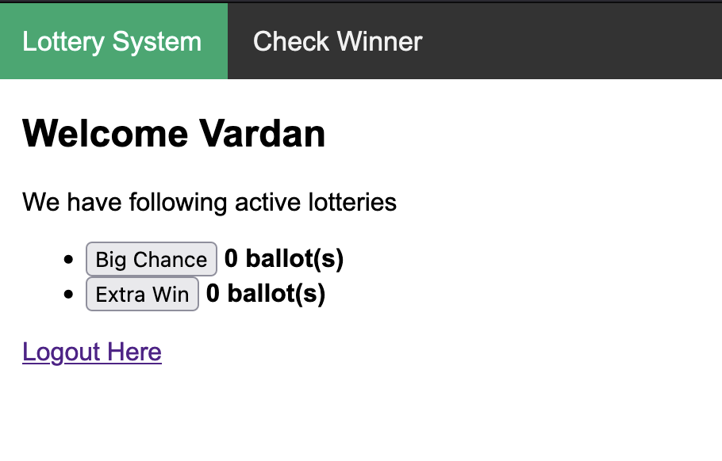
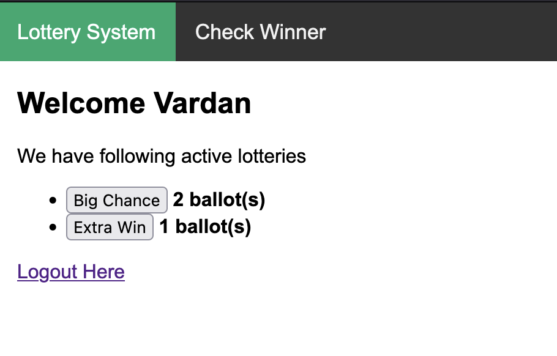
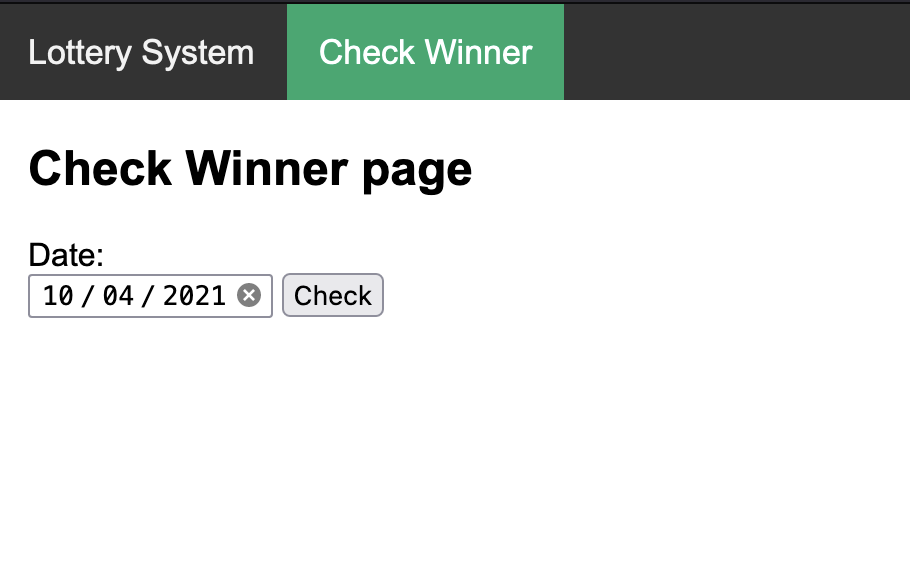
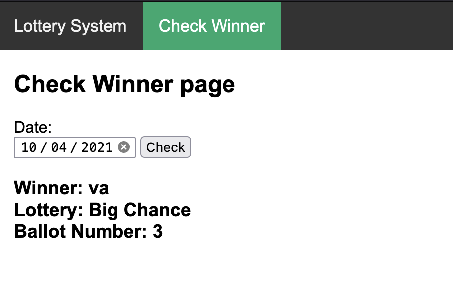

# Lottery System application
This is assignment exercise.
The goal of this exercise is to build lottery system application.

Requirements

- The service will allow anyone to register as a lottery participant.
- Lottery participants will be able to submit as many lottery ballots for any lottery that isn’t yet finished.
- Each day at midnight the lottery event will be considered closed and a random lottery winner will be selected from all participants for the day.
- All users will be able to check the winning ballot for any specific date.
- The service will have to persist the data regarding the lottery.
- Please put focus on the domain model of this problem it deserve attention.

## How to BUILD and RUN
It assumes that you already have downloaded or cloned repository and you have `docker-compose` installed on your machine.

```bash
# Move into the working directory
cd lottery-system
```
```bash
# Build docker-compose file
docker-compose -f docker-compose.yml build
```

```bash
# Run docker-compose file
docker-compose -f docker-compose.yml up
```
In terminal you will see something like this

```bash
% docker-compose -f docker-compose.yml up  
Creating network "lottery-system_default" with the default driver
Creating lottery-system_lottery-system_1 ... done
Attaching to lottery-system_lottery-system_1
lottery-system_1  | [2021-10-04 22:12:30 +0000] [1] [INFO] Starting gunicorn 20.1.0
lottery-system_1  | [2021-10-04 22:12:30 +0000] [1] [INFO] Listening at: http://0.0.0.0:8080 (1)
lottery-system_1  | [2021-10-04 22:12:30 +0000] [1] [INFO] Using worker: gevent
lottery-system_1  | [2021-10-04 22:12:30 +0000] [9] [INFO] Booting worker with pid: 9
lottery-system_1  | 2021-10-04 22:12:31,147 : INFO : Scheduler started
lottery-system_1  | 2021-10-04 22:12:31,173 : INFO : Added job "midnight_award" to job store "default"

```
Click [http://0.0.0.0:8080](http://0.0.0.0:8080) to navigate to the application

## HOW TO USE THE APPLICATION

If there's no authenticated users yet (There's no Session ID in browsers Cookies), user will be redirected to `login` page



First, user needs to register. Click _Sign Up here_ text for the registration and fill your desired username and password and click *Sign Up*



---

After successful registration and login, user will see this



Here are showing all active lotteries and ballots number corresponding to the lotteries.

---

For submitting ballots user needs to click onto the lottery (example 2x time "Big Chance" and 1x time on "Extra Win")


 
In the above image, user Vardan submitted 2 ballots for "Big Chance", and 1 ballot for "Extra Win" Lottery

---

In Check Winner page, user can check the winner ballots, by specifying the date



Example



---

## How to STOP and CLEAN-UP

```bash
# Stop running docker-compose container and clean-up
# ctrl+c # Keyboard Interrupt will stop running container
docker-compose -f docker-compose.yml down # clean up
```

---

## domain model, implementation details, Best Practices, Omitted parts

### domain model

First, let's look at class diagram of this problem, which is used to represent the domain model


Let's highlight base logic behind the domain model.

- *`Admin` creates Lotteries by specifying `name` and `due-date`
- Lottery participants can register in the Lottery-System specifying `username` and `password`, using `Registration` form
- Authenticated users have ability to submit (add data to `Ballots`) as many lottery ballots for any lottery that isn’t yet finished (`root function POST request`).
- Regardless of everything, each day at midnight `Scheduler` (attached function) randomly chooses lottery winner from all participants for the day, and adds it into `Winners` table.
- Authenticated users have ability to check the winning ballot for any specific date (`check_winner`).

First bullet point is marked with ` Asterisk: *`, because it is not fully implemented (will discuss below).

Domain model here is pretty straightforward.

Here are database models (tables) behind the domain model 

- UserModel
- LotteryModel
- BallotsModel
- WinnersModel

Explanation of ballot submitting process in a few bullet points:

- User is authenticated -> we know `user_id`
- User chooses lottery -> we know `lottery_id`
- Having `user_id` and `lottery_id` we are adding new row to our `Ballots` table. 
- Ballots' primary key is incrementing by guarantying unique ballot number for each submission
- Scheduler which is running at midnight, randomly chooses a ballot from filtered Ballots 
(filtered by `Ballots.date == today`) and fills new row into `Winners` table
- Users can check the winner ballot also winner's username and lottery name also by specifying the date

I would not bring here many details, for keeping the documentation as simple as possible. 
There's only 2 points that deserves attention related models, that I would like to mention:

- We provided a `user_loader` callback in `models.py`. 
This callback is used to reload the user object from the user ID stored in the session. 
- We decorate `create_lotteries` function with `@event.listens_for(LotteryModel.__table__, "after_create")`
decorator, for achieving autofill process, if we want dummy data in our models. 
This event based approach is best practice filling your tables when they are created.

### Implementation details

Technical Stack

- `Flask` - web framework
- `Flask-SQLAlchemy`, `SQLAlchemy` - database connector, ORM (flask extension)
- `SQLite` - database service
- `Flask-APScheduler` - Task scheduler (flask extension)
- `Flask-Login` - login manager (flask extension)
- `gunicorn` - Python Web Server Gateway Interface (WSGI) HTTP server.
- `docker-compose`, `docker` - Container runtime

    
    Application uses UTC timezone in database also in scheduler

#### Design Decisions

- When I was designing the application I was faced to the dilemma, whether to built feature rich REST Api or
fully functional but very simple web application with modest frontend.
As you see, I chose the second, because of some reasons:

   - As I was familiar with Jinja templating library, it would be faster for creating modest frontend
   - Application requires User registration, login, logout and this kind of 
   functionality is easy while using login-manager extension, because it has cool features like 
    `current_user`, `login_required`, `login_user`, `logout_user`, and you just need `init_your_app` and 
   you have all those functionalities. It's obvious that for taking full advantage of these features, You will
   require frontend. (redirects)

- For ease of simplicity I used `SQLite` instead of other powerful database system (`PostgreSQL`, `MySQL`).
In production, I would use one of above-mentioned database systems for this project.

- For keeping SQLite's `.db` file I choose separate folder (`storage`), although that is configurable from `config/development.py`, 
because, we could attach volume afterwards in docker-compose configuration, and application will create
`.db` file inside shared folder. Thus, we will save our date when we shut down the container.

- One of the advantages of choosing flask-login manager extension, that it provides Cookie-
based authentication. When the user logs in Flask creates a session containing
`user_id` and then sends the `Session_id` to the user via a Cookie. 
By using the extension we easily have good authentication process.

### Best Practice

In this section I will separate some key points about Best Practices which I used, 
though about some other points, I have mentioned in another sections of this documentation.

- It is best practice to use SQLAlchemy especially Flask-SQLAlchemy extension while deploying
application using Flask framework.
SQLAlchemy is an Object Relational Mapper (ORM), which means, you can use the database using python code, 
rather than initiating SQL code. Also, it manages database connection (timeouts for example).
 Flask-SQLAlchemy itself takes care web related settings allowing to focus on coding rather than managing the db.

- While deploying web applications written in Flask or Django, it is a best practice to use gunicorn WSGI server.
Gunicorn works between the web server (`nginx`, `Apache server`) and your app as a load distributor and requests optimizer.
It is built for making python web application stable in case of large amount of requests.
It has the concepts of workers, and the ability to configure those workers in order to handle 
parallel requests. It accepts some kind of worker class configurations such as greenlets, gthreads, async, etc...
It works well with nginx web server, but unfortunately I didn't implement this part in the solution, because of the lack of time.

- I kept PEP8 standards (It is configured in my PyCharm, and it makes my life easier),
As a docstring format I used Google style format.
After submitting the code I run python `black` formatter and `isort` utility for sorting python library imports.

- As I mentioned in domain model section, I used event based approach for injecting database by some dummy data 
(`@event.listens_for(LotteryModel.__table__, "after_create")`).


### Omitted

- I omitted to configure nginx web server inside docker image, because I though
it would be some kind of extra-feature for this task.
Currently, my Dockerfile using standard python3.8 image which built on 
light alpine linux OS, which in turn uses [Lighttpd](https://www.lighttpd.net/) web server
So I decided to rely on that web server.

- I omitted also the part of Lottery Creation and Modification (change due_date after expiration) part 
because again I thought it would be extra feature for this task.


### What am I particularly proud of in my implementation ?

- I am proud of my documentation. It appears pretty straightforward, but
still covers almost every detail. :) 

- I am proud, that I manage to finish the task in time in containerized form.
